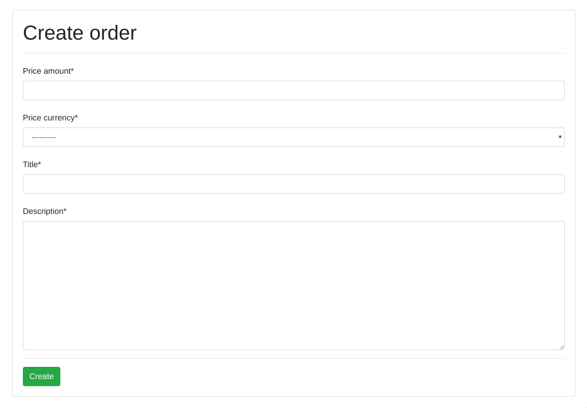
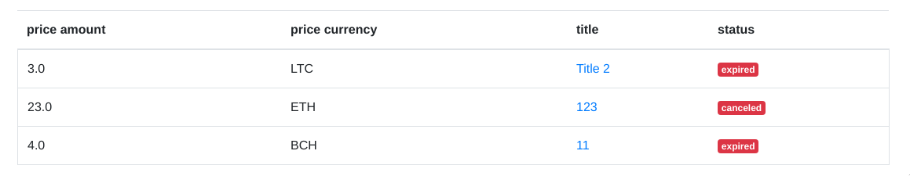
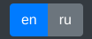

### [Coingate](https://coingate.com) integration using Django

To be able run this project you should install `pipenv`:

`pip install pipenv`

Then you should install all the required dependencies(`pipenv install`) and run the virtual environment (`pipenv shell`)

Then move to the 'django' folder and run the server.

---

##### In this app you are able to: 

Create new order:

(After the creation you will be redireced to your payment at [coinsgate.com](https://coingate.com))

Check the list of all orders you created:

And toggle langugage any moment you want:

